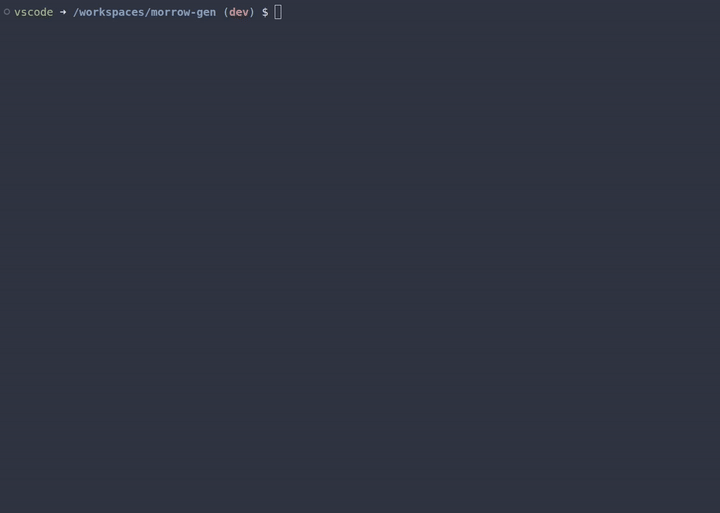

# Morrowind Lore-Accurate Character Generator



Ruby application that generates **sound** and **lore-accurate** character sheets for *The Elder Scrolls III: Morrowind*.

## Features

* **Lore-Accurate Naming Engine:**
* Generates race-specific names (e.g., "Ash-Hanta" for Ashlanders, "Moghakh" for Orcs).
* **Argonians:** Generates dynamic Cyrodilic phrases (e.g., *"Hides-His-Eyes"*, *"Walks-In-Shadows"*) or traditional Jel names.
* **Orcs:** Correctly handles gendered surnames (`gro-` for males, `gra-` for females).
* **Imperials:** Context-aware gender suffixes for Roman-style names.


* **True Stat Calculation:**
* Calculates **Attributes** by summing: `Race Base Stats` + `Gender Differences` + `Birthsign Bonuses` + `Class Favored Attributes`.


* **Complete Skill Generation:**
* Assigns **Major** (Base 30), **Minor** (Base 15), and **Misc** (Base 5) skills.
* Applies **+5 Specialization Bonus** (Combat/Magic/Stealth) to all relevant skills.
* Applies **Racial Bonuses** (e.g., Dunmer get +10 Destruction).
* Outputs the final, calculated value for every skill.

**Examples:**

```bash
ruby MorrowGen.rb male orc
```

## Example Output

```text
==========================================
IDENTITY
Name:      Durzum gro-Bagrat
Race:      Male Orc
Birthsign: The Steed
Class :    Healer
------------------------------------------
ATTRIBUTES
STR: 45  INT: 30
WIL: 60  AGI: 35
SPD: 55  END: 50
PER: 40  LUC: 40
------------------------------------------
SKILLS
Major:
     35 Alteration
     35 Mysticism
     35 Restoration
     30 Hand_to_hand
     30 Speechcraft
Minor:
     15 Blunt_weapon
     20 Illusion
     20 Alchemy
     20 Unarmored
     15 Light_armor
Other:
     15 Heavy_armor
     15 Medium_armor
     5 Spear
     15 Armorer
     10 Axe
     5 Long_blade
     15 Block
     5 Athletics
     10 Conjuration
     10 Enchant
     10 Destruction
     5 Acrobatics
     5 Marksman
     5 Sneak
     5 Short_blade
     5 Mercantile
     5 Security
     5 Luck
==========================================
```

## Roadmap

* [ ] **Custom Class Generator:** Random, yet **sound** class gen (right now we pick pre-made classes). This would be semi-random, avoiding things such as having contradictory choices (Heavy armor and unarmored as major skills, etc...)
* [ ] **AI Backstories:** Integration with LLMs to generate a biography explaining *why* your Orc Archer knows Restoration.
* [ ] **Interactive CLI:** A robust menu system for easier selection.